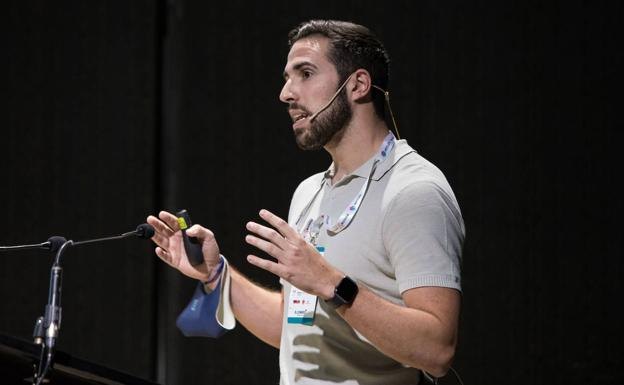

### Welcome to Alfonso Medela's Github!

<!--
**alfonmedela/alfonmedela** is a ✨ _special_ ✨ repository because its `README.md` (this file) appears on your GitHub profile.

Here are some ideas to get you started:

- 🔭 I’m currently working on ...
- 🌱 I’m currently learning ...
- 👯 I’m looking to collaborate on ...
- 🤔 I’m looking for help with ...
- 💬 Ask me about ...
- 📫 How to reach me: ...
- 😄 Pronouns: ...
- ⚡ Fun fact: ...
-->

# [Alfonso Medela](https://alfonsomedela.com/)
## Chief AI Officer at [Legit.Health](https://legit.health/)

## [Webinars](https://www.youtube.com/watch?v=WsUU6BNanfY&list=PLZl2Y4CljnAwnXV4iXbRmMiBBUZn72e6N&index=3)
## [Scientific articles](https://scholar.google.com/citations?user=3zx75AUAAAAJ&hl=en)
